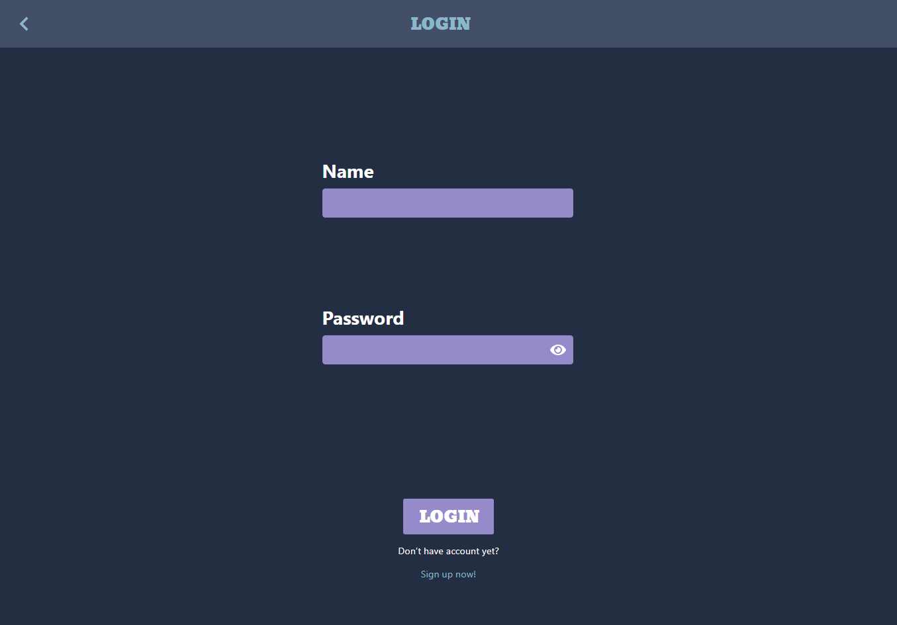

# Awesome-chat-app-beta

Awesome-chat-app-beta is a (school)project which combains Node.js® Express REST API and React frontend. REST API can be used as a stand alone API but it requires API key (jwt).
Version deployd to [HEROKU](https://awesomechatappbeta.herokuapp.com/) is the API configurated to serve the static React app.

# REST API

The REST API is described below.

## Login

### Request

`POST /login/`

    POST https://awesomechatappbeta.herokuapp.com/api/login/

    Content-Type: application/json

    {
      "username": "testuser",
      "password": "Test1234!"
    }

### Response

    HTTP/1.1 200 OK
    Server: Cowboy
    Connection: close
    X-Powered-By: Express
    Access-Control-Allow-Origin: *
    Content-Type: application/json; charset=utf-8
    Content-Length: 243
    Etag: W/"f3-ENpdahA4XoOYTwAlwIgurO+qK/g"
    Date: Thu, 14 Oct 2021 19:58:19 GMT
    Via: 1.1 vegur

    {
      "token": "{token}",
      "username": "testuser",
      "id": "616884cdfa0840904d1813bd"
    }

## Get all messages for specific room

### Request

`GET /messages/`

    GET https://awesomechatappbeta.herokuapp.com/api/messages?roomId=615bf8f991eccc3e0e235ec4
    Content-Type: application/json
    Authorization: Bearer {your_token}

### Response

    HTTP/1.1 200 OK
    Server: Cowboy
    Connection: close
    X-Powered-By: Express
    Access-Control-Allow-Origin: *
    Content-Type: application/json; charset=utf-8
    Content-Length: 1355
    Etag: W/"54b-dqgWW3gwWb+PMXfVu6IVG6+1MEU"
    Date: Thu, 14 Oct 2021 20:02:25 GMT
    Via: 1.1 vegur

    [
      {
        "_id": "6167d2b58300fe3422f6b886",
        "roomName": "615bf8f991eccc3e0e235ec4",
        "room": null,
        "content": "Moi",
        "date": "Thu Oct 14 2021 06:48:22 GMT+0000 (Coordinated Universal Time)",
        "user": "testinen",
        "id": "6167d2b58300fe3422f6b886"
      },
      {
        "_id": "6167d2ea8300fe3422f6b887",
        "roomName": "615bf8f991eccc3e0e235ec4",
        "room": null,
        "content": "Hello there",
        "date": "Thu Oct 14 2021 06:49:14 GMT+0000 (Coordinated Universal Time)",
        "user": "testinen",
        "id": "6167d2ea8300fe3422f6b887"
      },
      ...
    ]

### Request

## Get a specific message

`GET /messages/:id`

    GET https://awesomechatappbeta.herokuapp.com/api/messages/6167d2b58300fe3422f6b886
    Content-Type: application/json
    Authorization: Bearer {your_token}

### Response

    HTTP/1.1 200 OK
    Server: Cowboy
    Connection: close
    X-Powered-By: Express
    Access-Control-Allow-Origin: *
    Content-Type: application/json; charset=utf-8
    Content-Length: 417
    Etag: W/"1a1-9XGUU29ti0cBTlUDp6WBq22kfgU"
    Date: Thu, 14 Oct 2021 20:15:28 GMT
    Via: 1.1 vegur

    {
      "_id": "6167d2b58300fe3422f6b886",
      "roomName": "615bf8f991eccc3e0e235ec4",
      "room": "615bf8f991eccc3e0e235ec4",
      "content": "Moi",
      "date": "Thu Oct 14 2021 06:48:22 GMT+0000 (Coordinated Universal Time)",
      "user": "testinen",
      "id": "6167d2b58300fe3422f6b886"
    }

## Post a message

### Request

`POST /messages/`

    GET https://awesomechatappbeta.herokuapp.com/api/messages/
    Content-Type: application/json
    Authorization: Bearer {your_token}

    {
      "_id": {new ObjectId().toString()},
      "roomName": {roomId.id,}
      "room": {roomId.id},
      "user": {getUser()},
      "content": {messageContent},
    }

### Response

    HTTP/1.1 200 OK
    Server: Cowboy
    Connection: close
    X-Powered-By: Express
    Access-Control-Allow-Origin: *
    Content-Type: application/json; charset=utf-8
    Content-Length: 417
    Etag: W/"1a1-9XGUU29ti0cBTlUDp6WBq22kfgU"
    Date: Thu, 14 Oct 2021 20:15:28 GMT
    Via: 1.1 vegur

    {
      "id": "_id"",
      "content": "{messageContent}"
    }

## Get all rooms populated by messages

### Request

`GET /rooms/`

    GET https://awesomechatappbeta.herokuapp.com/api/rooms/
    Content-Type: application/json
    Authorization: Bearer {your_token}

    {
      "_id": {new ObjectId().toString()},
      "roomName": {roomId.id,}
      "room": {roomId.id},
      "user": {getUser()},
      "content": {messageContent},
    }

### Response

    HTTP/1.1 200 OK
    Server: Cowboy
    Connection: close
    X-Powered-By: Express
    Access-Control-Allow-Origin: *
    Content-Type: application/json; charset=utf-8
    Content-Length: 417
    Etag: W/"1a1-9XGUU29ti0cBTlUDp6WBq22kfgU"
    Date: Thu, 14 Oct 2021 20:15:28 GMT
    Via: 1.1 vegur

    [
      {
        "name": "HAIPPIRINKI",
        "id": "615bf91791eccc3e0e235ec5",
        "messages": [
          {
            "_id": "6165eb824493f662142e5733",
            "content": "https://tenor.com/view/hackerman-gif-13247932.gif",
            "date": "Tue Oct 12 2021 23:09:38 GMT+0300 (Eastern European Summer Time)",
            "id": "6165eb824493f662142e5733"
          }
        ]
      },
      {
        "name": "Myllypuron lavatanssit",
        "messages": [],
        "id": "6165f02e97a6f2d2289fca26"
      },
      {
        "name": "asdfasf",
        "messages": [],
        "id": "6168821cfa0840904d1813b6"
      }
    ]

### Request

## Get a specific room

`GET /rooms/:id`

    GET https://awesomechatappbeta.herokuapp.com/api/rooms/6165f02e97a6f2d2289fca26
    Content-Type: application/json
    Authorization: Bearer {your_token}

### Response

    HTTP/1.1 200 OK
    Server: Cowboy
    Connection: close
    X-Powered-By: Express
    Access-Control-Allow-Origin: *
    Content-Type: application/json; charset=utf-8
    Content-Length: 417
    Etag: W/"1a1-9XGUU29ti0cBTlUDp6WBq22kfgU"
    Date: Thu, 14 Oct 2021 20:15:28 GMT
    Via: 1.1 vegur

    {
      "name": "Myllypuron lavatanssit",
      "messages": [],
      "id": "6165f02e97a6f2d2289fca26"
    }

## Create a new room

### Request

`POST /rooms/`

    GET https://awesomechatappbeta.herokuapp.com/api/rooms/6165f02e97a6f2d2289fca26
    Content-Type: application/json
    Authorization: Bearer {your_token}

    {
      "name": "asdfasf"
    }

### Response

    HTTP/1.1 200 OK
    Server: Cowboy
    Connection: close
    X-Powered-By: Express
    Access-Control-Allow-Origin: *
    Content-Type: application/json; charset=utf-8
    Content-Length: 417
    Etag: W/"1a1-9XGUU29ti0cBTlUDp6WBq22kfgU"
    Date: Thu, 14 Oct 2021 20:15:28 GMT
    Via: 1.1 vegur

    {
      "name": "asdfasf",
      "messages": [],
      "id": "6168913dfa0840904d1813cd"
    }

## Modify a specific room

### Request

`PUT /rooms/:id`

    GET https://awesomechatappbeta.herokuapp.com/api/rooms/6165f02e97a6f2d2289fca26
    Content-Type: application/json
    Authorization: Bearer {your_token}

    {
      "name": "asdfasf"
    }

### Response

    HTTP/1.1 200 OK
    Server: Cowboy
    Connection: close
    X-Powered-By: Express
    Access-Control-Allow-Origin: *
    Content-Type: application/json; charset=utf-8
    Content-Length: 417
    Etag: W/"1a1-9XGUU29ti0cBTlUDp6WBq22kfgU"
    Date: Thu, 14 Oct 2021 20:15:28 GMT
    Via: 1.1 vegur

    {
      "name": "asdfasf",
      "messages": [],
      "id": "6168913dfa0840904d1813cd"
    }

## Delete a specific room

### Request

`DELETE /rooms/:id`

    GET https://awesomechatappbeta.herokuapp.com/api/rooms/6165f02e97a6f2d2289fca26
    Content-Type: application/json
    Authorization: Bearer {your_token}

    {
      "name": "asdfasf"
    }

### Response

    HTTP/1.1 200 OK
    Server: Cowboy
    Connection: close
    X-Powered-By: Express
    Access-Control-Allow-Origin: *
    Content-Type: application/json; charset=utf-8
    Content-Length: 417
    Etag: W/"1a1-9XGUU29ti0cBTlUDp6WBq22kfgU"
    Date: Thu, 14 Oct 2021 20:15:28 GMT
    Via: 1.1 vegur

    {
      "name": "asdfasf",
      "messages": [],
      "id": "6165f02e97a6f2d2289fca26"
    }

## Get all users

### Request

`GET /users/`

    GET https://awesomechatappbeta.herokuapp.com/api/users
    Content-Type: application/json
    Authorization: Bearer {your_token}

### Response

    HTTP/1.1 200 OK
    Server: Cowboy
    Connection: close
    X-Powered-By: Express
    Access-Control-Allow-Origin: *
    Content-Type: application/json; charset=utf-8
    Content-Length: 1853
    Etag: W/"73d-0svBIJzGXA3PNdQF1Q5UHuBYmxg"
    Date: Thu, 14 Oct 2021 20:26:57 GMT
    Via: 1.1 vegur

    [
      {
        "_id": "615c227fe8adcfb376083744",
        "username": "ironman",
        "id": "615c227fe8adcfb376083744"
      },
      {
        "_id": "615c33781c17b3ad5fae602a",
        "username": "test69",
        "id": "615c33781c17b3ad5fae602a"
      },
      {
        "_id": "6160214906a3d4797a3a12ee",
        "username": "vittusaatana",
        "id": "6160214906a3d4797a3a12ee"
      },
      ...
    ]

## Get a specific user

### Request

`GET /users/:id

    GET https://awesomechatappbeta.herokuapp.com/api/users/{userid}
    Content-Type: application/json
    Authorization: Bearer {your_token}

### Response

    HTTP/1.1 200 OK
    Server: Cowboy
    Connection: close
    X-Powered-By: Express
    Access-Control-Allow-Origin: *
    Content-Type: application/json; charset=utf-8
    Content-Length: 1853
    Etag: W/"73d-0svBIJzGXA3PNdQF1Q5UHuBYmxg"
    Date: Thu, 14 Oct 2021 20:26:57 GMT
    Via: 1.1 vegur

    {
      "_id": "{userid}",
      "username": "{username}",
      "id": "{userid}"
    }

## Create new user

### Request

`POST /users/`

    GET https://awesomechatappbeta.herokuapp.com/api/users/
    Content-Type: application/json
    Authorization: Bearer {your_token}

    {
      "username": "testuser",
      "password": "Test1234!"
    }

### Response

    HTTP/1.1 200 OK
    Server: Cowboy
    Connection: close
    X-Powered-By: Express
    Access-Control-Allow-Origin: *
    Content-Type: application/json; charset=utf-8
    Content-Length: 1853
    Etag: W/"73d-0svBIJzGXA3PNdQF1Q5UHuBYmxg"
    Date: Thu, 14 Oct 2021 20:26:57 GMT
    Via: 1.1 vegur

    {
      "username": "testuser1",
      "token": "{usertoken}",
      "id": "{userid}"
    }

## Modify a specific user

### Request

`PUT /users/`

    GET https://awesomechatappbeta.herokuapp.com/api/users/
    Content-Type: application/json
    Authorization: Bearer {your_token}

    {
      "username": "testuser",
      "password": "Test1234!",
      "newPassword": "Nest1234!",
    }

### Response

    HTTP/1.1 200 OK
    Server: Cowboy
    Connection: close
    X-Powered-By: Express
    Access-Control-Allow-Origin: *
    Content-Type: application/json; charset=utf-8
    Content-Length: 1853
    Etag: W/"73d-0svBIJzGXA3PNdQF1Q5UHuBYmxg"
    Date: Thu, 14 Oct 2021 20:26:57 GMT
    Via: 1.1 vegur

    {
      "username": "testuser1",
      "token": "{usertoken}",
      "id": "{userid}"
    }

## Delete a specific user

### Request

`DELETE /users/:id`

    GET https://awesomechatappbeta.herokuapp.com/api/users/{userid}
    Content-Type: application/json
    Authorization: Bearer {your_token}

### Response

    HTTP/1.1 200 OK
    Server: Cowboy
    Connection: close
    X-Powered-By: Express
    Access-Control-Allow-Origin: *
    Content-Type: application/json; charset=utf-8
    Content-Length: 1853
    Etag: W/"73d-0svBIJzGXA3PNdQF1Q5UHuBYmxg"
    Date: Thu, 14 Oct 2021 20:26:57 GMT
    Via: 1.1 vegur

## Contribution

[@JoniLauk](https://github.com/JoniLauk)

[@matiasvainio](https://github.com/matiasvainio)

## Contributing

Pull requests are welcome. Please don't do trickeries.
